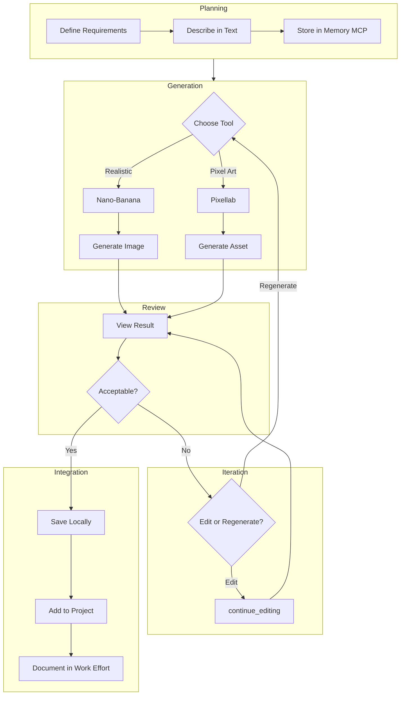
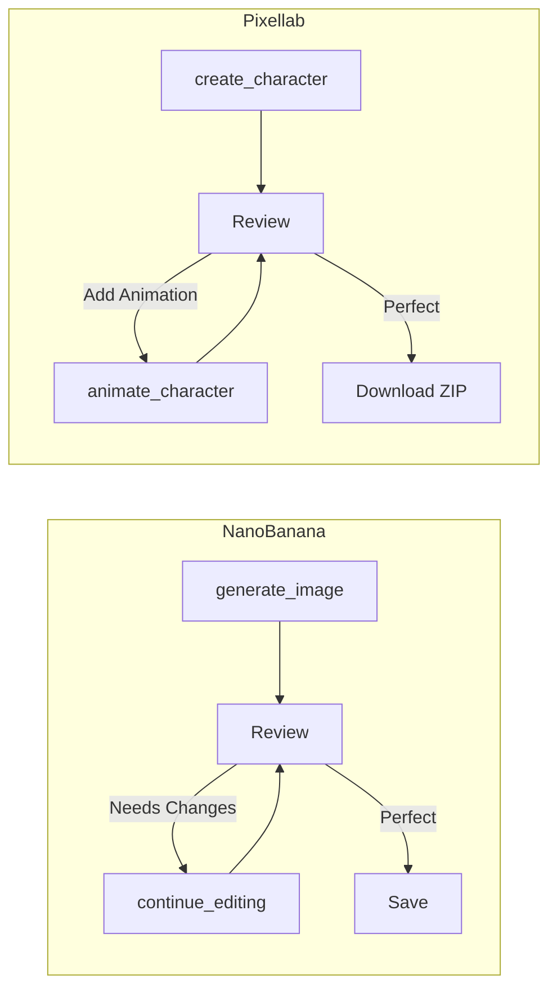
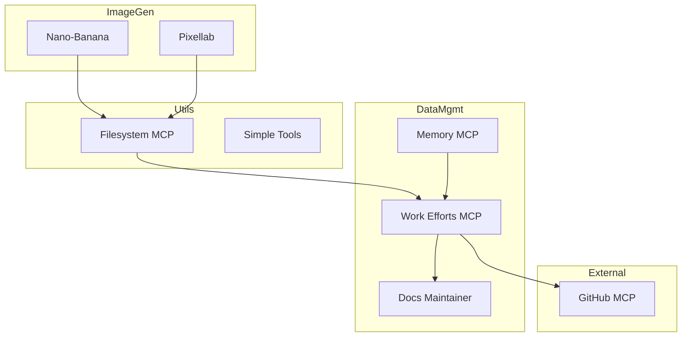

# MCP Image Generation Workflow

> Iterative image development using Pixellab and Nano-Banana MCP servers.

**Created:** 2025-12-21
**Context:** Planning session for cursor-coding-protocols documentation

---

## Overview

This document describes the image generation workflow enabled by combining multiple MCP servers for iterative development.

---

## Available MCP Image Tools

### 1. Pixellab MCP (Pixel Art)

**Purpose:** Generate pixel art assets for games, UI, and retro-style graphics.

| Tool | Description |
|------|-------------|
| `create_character` | Character sprites (4 or 8 directions) |
| `animate_character` | Add animations (walk, idle, attack) |
| `create_isometric_tile` | Isometric building blocks |
| `create_map_object` | Props and decorations |
| `create_topdown_tileset` | Wang tilesets for terrain |
| `create_sidescroller_tileset` | Platformer tiles |

**Storage:** Cloud-based, permanent for characters/tiles

### 2. Nano-Banana MCP (AI Art via Gemini)

**Purpose:** Generate realistic/artistic images using Google's Gemini 2.5 Flash.

| Tool | Description |
|------|-------------|
| `generate_image` | Create new image from prompt |
| `edit_image` | Edit specific file + reference images |
| `continue_editing` | Refine last generated image |
| `get_last_image_info` | Check current working image |

**Storage:** Local files in `~/generated_imgs/`

---

## Workflow Diagrams

### High-Level Image Development Flow



### Iterative Refinement Loop



### MCP Server Ecosystem



---

## Use Case Examples

### 1. UI Component Design

```
1. Describe component: "A rounded button with gradient"
2. Generate mockup: nano-banana generate_image
3. Iterate: continue_editing "softer shadow"
4. Create pixel version: pixellab create_map_object
5. Save both to project/assets/
```

### 2. Game Character Pipeline

```
1. Design: "Wizard with blue robes, pointy hat"
2. Generate: pixellab create_character (8 directions)
3. Add animations: animate_character with "walk", "idle"
4. Download ZIP with all assets
```

### 3. Documentation Illustrations

```
1. Need diagram: "Show data flow between services"
2. Generate: nano-banana with detailed prompt
3. Iterate until clear
4. Save to docs/images/
```

---

## Best Practices

### Image Generation Tips

1. **Be specific in prompts** - Include style, mood, colors
2. **Use continue_editing** - Don't regenerate from scratch
3. **Reference images** - Use `edit_image` with references for style consistency
4. **Save locally** - Cloud storage may expire
5. **Document decisions** - Use Memory MCP to track choices

### Workflow Tips

1. **Plan before generating** - Text description first
2. **Version your assets** - Save iterations, not just finals
3. **Track in work efforts** - Document the design process
4. **Combine tools** - Nano-Banana for concepts, Pixellab for production

---

## Technical Details

### Pixellab Asset Specifications

| Asset Type | Sizes | Directions |
|------------|-------|------------|
| Characters | 16-128px | 4 or 8 |
| Isometric Tiles | 16-64px | N/A |
| Map Objects | 32-400px | N/A |
| Tilesets | 16 or 32px | N/A |

### Nano-Banana Output

- Format: PNG
- Location: `~/generated_imgs/` or `~/Documents/nano-banana-images/`
- Naming: `generated-[timestamp]-[id].png`

---

## Files Created This Session

| File | Location | Purpose |
|------|----------|---------|
| `planning-programmer-*.png` | `.mcp-servers/pixellab-assets/` | Pixel art character |
| `document-stack.png` | `.mcp-servers/pixellab-assets/` | Isometric tile |
| `computer-monitor.png` | `.mcp-servers/pixellab-assets/` | Map object |
| `planning-meme-nano-banana.png` | `.mcp-servers/pixellab-assets/` | AI-generated meme |

---

*Created during cursor-coding-protocols documentation session, 2025-12-21*
