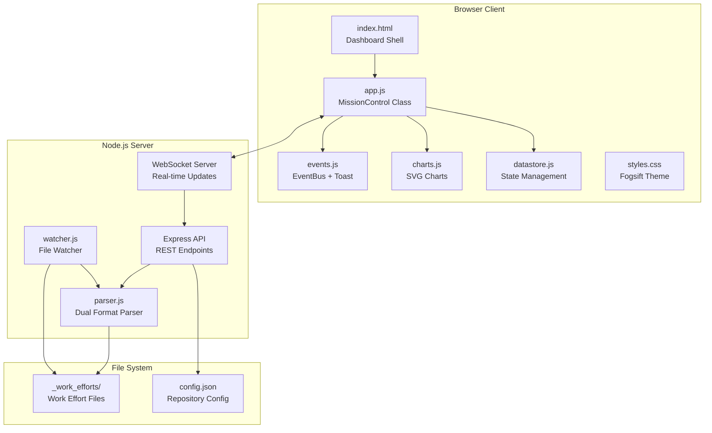
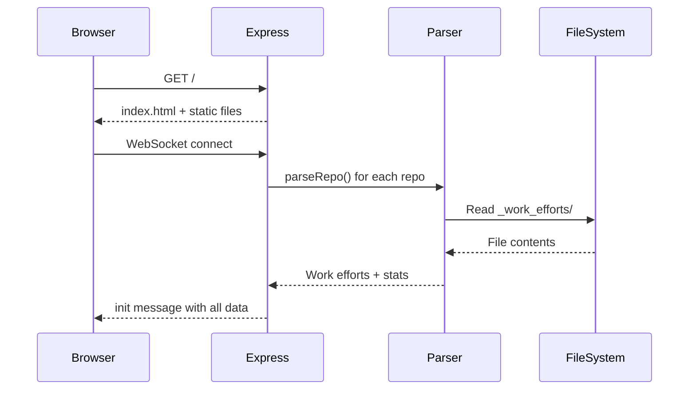
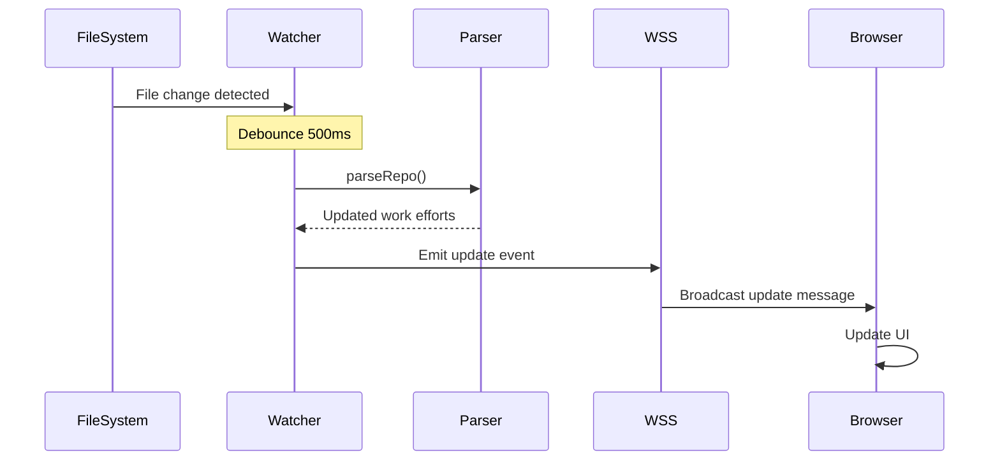

# Mission Control Dashboard - Architecture

## Overview

Mission Control is a real-time dashboard for monitoring work efforts across multiple repositories. It provides a unified view of task management using both Johnny Decimal and MCP v0.3.0 formats.

## System Architecture



## Component Breakdown

### Server Components

#### `server.js` (765 lines)
The main server application combining Express HTTP server and WebSocket server.

**Responsibilities:**
- Serve static files from `/public`
- Provide REST API endpoints for repository management
- Manage WebSocket connections for real-time updates
- Coordinate file watchers for multiple repositories
- Handle demo mode API for live demonstrations

**Key Classes/Functions:**
- `loadConfig()` / `saveConfig()` - Configuration persistence
- `initRepo()` - Initialize repository watching and parsing
- `refreshRepo()` - Re-parse and broadcast updates
- `broadcast()` - Send WebSocket messages to all clients

#### `lib/parser.js` (235 lines)
Dual-format parser supporting both work effort formats.

**Formats Supported:**
1. **MCP v0.3.0**: `WE-YYMMDD-xxxx_slug/` directories with `TKT-xxxx-NNN` tickets
2. **Johnny Decimal**: `XX-XX_category/XX_subcategory/XX.XX_document.md` files

**Key Functions:**
- `parseRepo()` - Main entry point, detects format and delegates
- `parseMCPWorkEffort()` - Parse MCP format work effort
- `parseMCPTickets()` - Parse tickets within MCP work effort
- `parseJohnnyDecimalCategory()` - Parse JD category structure
- `getRepoStats()` - Calculate summary statistics

#### `lib/watcher.js` (140 lines)
Debounced file watcher for detecting changes in work effort directories.

**Features:**
- Debounced updates (configurable, default 500ms)
- Throttled emissions (minimum 2 seconds between updates)
- Multi-repository support
- Event emitter pattern for change notifications

### Client Components

#### `public/app.js` (2,838 lines)
Main client application class.

**Class: `MissionControl`**

**State Management:**
- `repos` - Repository data from server
- `selectedItem` - Currently selected work effort/ticket
- `currentFilter` - Active filter (all/active/pending/completed)
- `searchQuery` - Current search string

**Key Methods:**
- `connect()` - Establish WebSocket connection with auto-reconnect
- `handleMessage()` - Process incoming WebSocket messages
- `render*()` - Various rendering methods for UI components
- `showDetailView()` - Display work effort detail page
- `startDemo()` - Run live demo walkthrough

**Activity Tracking:**
- Window focus detection
- Idle detection (30 second threshold)
- Smart notification routing based on activity state

#### `public/events.js` (814 lines)
Event system with toast notifications and animations.

**Class: `EventBus`**
Central event management with:
- Wildcard subscriptions (`workeffort:*`)
- Middleware support
- Event history tracking
- Batched emissions for rapid events
- Metrics collection

**Class: `ToastManager`**
Enhanced notification system:
- Type-based durations (error = persistent, info = 5s)
- Progress bar animations
- Pause on hover
- Action buttons
- Maximum visible limit (5)

**Class: `AnimationController`**
UI animations triggered by events:
- Element-specific animations
- Celebration effects for completions
- Selector-based batch animations

#### `public/charts.js` (417 lines)
SVG chart generation library.

**Chart Types:**
- `createDonutChart()` - Progress/distribution visualization
- `createBarChart()` - Comparison charts
- `createLineChart()` - Trend over time
- `createSparkline()` - Compact trend indicators
- `createHeatmap()` - Activity visualization
- `createProgressRing()` - Circular progress indicator

#### `public/datastore.js` (323 lines)
Centralized state management.

**Features:**
- Reactive state updates
- Local storage persistence
- WebSocket sync
- Computed properties

### Styling

#### `public/styles.css` (5,061 lines)
Comprehensive styling with Fogsift dark theme.

**CSS Organization:**
1. CSS Variables (colors, spacing, typography)
2. Reset and base styles
3. Layout components (sidebar, main, detail view)
4. Component styles (cards, buttons, badges)
5. Chart styling
6. Toast notifications
7. Animations and transitions
8. Responsive breakpoints

**Key Variables:**
```css
--accent: #ff9d3d;           /* Main amber/orange */
--accent-bright: #ffb86c;    /* Lighter amber */
--bg-deep: #0a0806;          /* Dark background */
--border: #3d352d;           /* Border color */
```

## Data Flow

### Initial Load


### Real-time Updates


## API Reference

### REST Endpoints

| Method | Endpoint | Description |
|--------|----------|-------------|
| GET | `/api/health` | Server health check |
| GET | `/api/repos` | List all repositories with state |
| GET | `/api/repos/:name` | Get single repository state |
| POST | `/api/repos` | Add new repository |
| DELETE | `/api/repos/:name` | Remove repository |
| PATCH | `/api/repos/:name/work-efforts/:id/status` | Update work effort status |
| GET | `/api/browse` | Browse directories |
| POST | `/api/repos/bulk` | Add multiple repositories |

### Demo API

| Method | Endpoint | Description |
|--------|----------|-------------|
| POST | `/api/demo/work-effort` | Create demo work effort |
| POST | `/api/demo/ticket` | Create demo ticket |
| PATCH | `/api/demo/ticket/:path` | Update ticket status |
| PATCH | `/api/demo/work-effort/:path` | Update work effort status |
| DELETE | `/api/demo/cleanup` | Remove demo work efforts |

### WebSocket Protocol

**Server → Client Messages:**
```javascript
// Initial state
{ type: "init", repos: { "name": { workEfforts, stats } } }

// Repository update
{ type: "update", repo: "name", workEfforts, stats }

// Repository added/removed
{ type: "repo_change", action: "added" | "removed", repo: "name" }

// Hot reload (dev mode)
{ type: "hot_reload", file: "filename" }
```

**Client → Server Messages:**
```javascript
// Request refresh
{ type: "refresh", repo: "name" }
```

## Configuration

### `config.json`
```json
{
  "port": 3847,
  "repos": [
    {
      "name": "_pyrite",
      "path": "/path/to/repo"
    }
  ],
  "debounceMs": 300
}
```

## File Structure

```
mcp-servers/dashboard/
├── server.js              # Main server (Express + WebSocket)
├── config.json            # Repository configuration
├── package.json           # Dependencies
├── lib/
│   ├── parser.js          # Dual-format parser
│   └── watcher.js         # Debounced file watcher
├── public/
│   ├── index.html         # Dashboard shell
│   ├── app.js             # MissionControl client
│   ├── events.js          # EventBus + ToastManager
│   ├── charts.js          # SVG chart library
│   ├── datastore.js       # State management
│   ├── styles.css         # Fogsift theme
│   ├── favicon.svg        # Brand icon
│   ├── assets/
│   │   ├── pyrite-logo-*.png/svg
│   │   └── brand-backup/  # Sacred brand assets
│   └── docs/
│       ├── index.html     # API documentation
│       └── ai-docs.txt    # AI reference
└── docs/
    ├── ARCHITECTURE.md    # This file
    ├── USER-GUIDE.md      # User documentation
    └── images/            # Screenshots
```

## Design Decisions

### Why Vanilla JavaScript?
- No build step required
- Fast iteration during development
- Hot reload for instant feedback
- Full control over bundle size

### Why Custom CSS over Framework?
- Maximum control over aesthetic
- Matches Fogsift brand identity
- No framework learning curve
- Smaller bundle size

### Why Dual Format Support?
- Johnny Decimal: Hierarchical organization, human-readable
- MCP v0.3.0: Tool-friendly, date-based IDs
- Supports migration between formats

### Why WebSocket + REST?
- WebSocket: Real-time updates, low latency
- REST: Stateless operations, easy debugging

## Performance Considerations

- **Debounced File Watching**: Prevents rapid re-parsing during bulk file operations
- **Throttled WebSocket Emissions**: Minimum 2 seconds between updates per repo
- **SVG Charts**: Lightweight, no external dependencies
- **CSS Animations**: GPU-accelerated, smooth performance
- **Hot Reload**: Development only, disabled in production

## Security Notes

- Directory browsing restricted to `/Users/ctavolazzi/Code`
- No authentication (local development only)
- File writes limited to _work_efforts directories
- No arbitrary code execution

